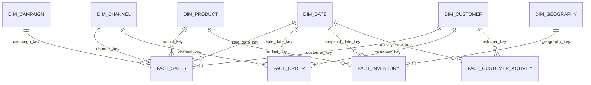

# Thiết kế Data Warehouse cho Fashion Store Analytics

## 1. Tổng quan nghiệp vụ

Dataset **European Fashion Store Multitable Dataset** mô phỏng hoạt động bán hàng của một cửa hàng thời trang tại nhiều quốc gia châu Âu. Dữ liệu gồm khách hàng, sản phẩm, đơn hàng, dòng sản phẩm trong đơn hàng, tồn kho, kênh bán hàng và chiến dịch marketing.

Mục tiêu của Data Warehouse là chuẩn hóa dữ liệu từ nhiều file CSV thành mô hình phân tích ổn định, dễ truy vấn bằng SQL và dễ kết nối với BI tools như Power BI, Tableau, Metabase hoặc Superset.

### 1.1. Bảng nguồn

| File nguồn | Số dòng | Vai trò nghiệp vụ | Cột chính |
|---|---:|---|---|
| `dataset_fashion_store_customers.csv` | 1,000 | Khách hàng | `customer_id`, `country`, `age_range`, `signup_date` |
| `dataset_fashion_store_products.csv` | 500 | Sản phẩm | `product_id`, `product_name`, `category`, `brand`, `color`, `size`, `catalog_price`, `cost_price`, `gender` |
| `dataset_fashion_store_sales.csv` | 905 | Đơn hàng | `sale_id`, `channel`, `discounted`, `total_amount`, `sale_date`, `customer_id`, `country` |
| `dataset_fashion_store_salesitems.csv` | 2,253 | Dòng sản phẩm trong đơn hàng | `item_id`, `sale_id`, `product_id`, `quantity`, `original_price`, `unit_price`, `discount_applied`, `discount_percent`, `discounted`, `item_total`, `sale_date`, `channel`, `channel_campaigns` |
| `dataset_fashion_store_stock.csv` | 1,000 | Tồn kho | `country`, `product_id`, `stock_quantity` |
| `dataset_fashion_store_campaigns.csv` | 7 | Chiến dịch marketing | `campaign_id`, `campaign_name`, `start_date`, `end_date`, `channel`, `discount_type`, `discount_value` |
| `dataset_fashion_store_channels.csv` | 2 | Kênh bán hàng chính thức | `channel`, `description` |

### 1.2. Câu hỏi kinh doanh có thể trả lời

| Nhóm câu hỏi | Ví dụ |
|---|---|
| Doanh thu | Doanh thu theo ngày/tháng/quốc gia/kênh/sản phẩm là bao nhiêu? |
| Đơn hàng | Có bao nhiêu đơn hàng? Giá trị trung bình mỗi đơn hàng là bao nhiêu? |
| Khách hàng | Nhóm tuổi/quốc gia nào mua nhiều nhất? Khách hàng mới đóng góp bao nhiêu doanh thu? |
| Sản phẩm | Category, brand, color, size nào bán chạy nhất? |
| Chiết khấu | Chiết khấu ảnh hưởng tới doanh thu và số lượng bán như thế nào? |
| Marketing | Campaign/channel nào tạo doanh thu tốt nhất? |
| Inventory | Sản phẩm nào tồn kho cao/thấp theo quốc gia? Có nguy cơ hết hàng không? |
| Profit | Lợi nhuận gộp ước tính theo sản phẩm/category/quốc gia là bao nhiêu? |

### 1.3. Nhóm dashboard phù hợp

| Dashboard | Nội dung |
|---|---|
| Executive Sales Overview | Revenue, orders, AOV, quantity sold, gross profit |
| Product Performance | Top products, category, brand, size, color, gender |
| Customer Analytics | Revenue by customer country, age range, signup cohort |
| Channel & Campaign Analytics | Sales by channel, campaign period, discount performance |
| Inventory Monitoring | Stock by country/product/category, stock coverage, low stock list |

## 2. Phân tích nghiệp vụ và phân loại bảng

### 2.1. Thực thể nghiệp vụ chính

| Thực thể | Loại | Nguồn |
|---|---|---|
| Customer | Dimension | `customers` |
| Product | Dimension | `products` |
| Date | Dimension | Sinh từ các cột ngày |
| Geography/Country | Dimension | `customers.country`, `sales.country`, `stock.country` |
| Channel | Dimension | `channels`, `sales.channel`, `salesitems.channel`, `campaigns.channel` |
| Campaign | Dimension | `campaigns`, suy luận từ `salesitems.channel_campaigns` |
| Sales Order | Fact | `sales` |
| Sales Line Item | Fact | `salesitems` kết hợp `sales` |
| Inventory Snapshot | Fact | `stock` |
| Customer Activity | Fact tổng hợp tùy chọn | `customers`, `sales` |

### 2.2. Grain đề xuất

| Fact table | Grain |
|---|---|
| `fact_sales` | 1 dòng cho mỗi dòng sản phẩm trong đơn hàng, tương ứng `item_id` |
| `fact_order` | 1 dòng cho mỗi đơn hàng, tương ứng `sale_id` |
| `fact_inventory` | 1 dòng cho mỗi `product_id` tại mỗi `country` ở một ngày snapshot |
| `fact_customer_activity` | 1 dòng cho mỗi khách hàng theo ngày hoạt động hoặc ngày đăng ký, dùng cho phân tích cohort/activity |

Ghi chú: `fact_sales` là fact chính vì đây là bảng chi tiết nhất, có product, quantity, price, discount và item total. `fact_order` nên được giữ riêng để phân tích order-level như AOV, số đơn hàng, đơn có chiết khấu.

## 3. Mô hình DWH đề xuất

### 3.1. Chọn Star Schema

Đề xuất dùng **Star Schema** làm mô hình chính.

Lý do:

| Tiêu chí | Star Schema | Snowflake Schema |
|---|---|---|
| Dễ hiểu cho sinh viên/BI | Rất tốt | Trung bình |
| Query dashboard | Nhanh, ít join | Nhiều join hơn |
| Dataset nhỏ | Phù hợp | Dễ phức tạp hóa |
| Dimension hiện tại | Không quá lớn | Không cần chuẩn hóa sâu |
| Mở rộng sau này | Vẫn mở rộng được | Tốt nhưng chưa cần |

Chọn Star Schema vì dataset nhỏ, mục tiêu là phân tích bán hàng và dashboard BI. Một số dimension như `dim_geography`, `dim_channel`, `dim_campaign` có thể tách riêng để tránh lặp và dễ quản trị.

### 3.2. Mô hình logic



## 4. Dimension Tables

### 4.1. `dim_date`

| Thuộc tính | Giá trị |
|---|---|
| Mục đích | Phân tích theo ngày, tháng, quý, năm, tuần |
| Grain | 1 dòng / 1 ngày |
| Primary key | `date_key` dạng `YYYYMMDD` |
| Natural key | `full_date` |
| SCD | Không cần |
| Nguồn | Sinh từ `sale_date`, `signup_date`, `start_date`, `end_date`, ngày snapshot inventory |

Thuộc tính: `full_date`, `day_of_week`, `day_name`, `day_of_month`, `week_of_year`, `month_number`, `month_name`, `quarter_number`, `year_number`, `is_weekend`.

### 4.2. `dim_customer`

| Thuộc tính | Giá trị |
|---|---|
| Mục đích | Phân tích khách hàng theo quốc gia, độ tuổi, cohort đăng ký |
| Grain | 1 dòng / 1 khách hàng |
| Primary key | `customer_key` surrogate key |
| Natural key | `customer_id` |
| SCD | Type 2 nếu theo dõi thay đổi `country`, `age_range`; Type 1 đủ cho project ban đầu |
| Nguồn | `dataset_fashion_store_customers.csv` |

Thuộc tính: `customer_id`, `age_range`, `signup_date`, `signup_date_key`, `effective_from`, `effective_to`, `is_current`.

### 4.3. `dim_product`

| Thuộc tính | Giá trị |
|---|---|
| Mục đích | Phân tích sản phẩm theo category, brand, color, size, gender |
| Grain | 1 dòng / 1 sản phẩm |
| Primary key | `product_key` surrogate key |
| Natural key | `product_id` |
| SCD | Type 2 khuyến nghị nếu `catalog_price`, `cost_price`, category thay đổi; Type 1 nếu chỉ làm snapshot hiện tại |
| Nguồn | `dataset_fashion_store_products.csv` |

Thuộc tính: `product_id`, `product_name`, `category`, `brand`, `color`, `size`, `gender`, `catalog_price`, `cost_price`, `effective_from`, `effective_to`, `is_current`.

### 4.4. `dim_geography`

| Thuộc tính | Giá trị |
|---|---|
| Mục đích | Chuẩn hóa quốc gia để phân tích theo thị trường |
| Grain | 1 dòng / 1 quốc gia |
| Primary key | `geography_key` |
| Natural key | `country` |
| SCD | Type 1 |
| Nguồn | `customers.country`, `sales.country`, `stock.country` |

Thuộc tính: `country`, `region`. Hiện tại có các country: France, Germany, Italy, Netherlands, Portugal, Spain. Có thể gán `region = 'Europe'`.

### 4.5. `dim_channel`

| Thuộc tính | Giá trị |
|---|---|
| Mục đích | Phân tích theo kênh bán hàng/marketing |
| Grain | 1 dòng / 1 channel |
| Primary key | `channel_key` |
| Natural key | `channel_name` |
| SCD | Type 1 |
| Nguồn | `channels`, `sales.channel`, `salesitems.channel`, `campaigns.channel` |

Ghi chú: file `channels` chỉ có `E-commerce`, `App Mobile`, trong khi campaigns có `Email`, `Social Media`, `Website Banner`. Nên hợp nhất tất cả channel vào dimension, thêm `channel_type` để phân biệt `Sales`, `Marketing`, `Unknown`.

### 4.6. `dim_campaign`

| Thuộc tính | Giá trị |
|---|---|
| Mục đích | Phân tích hiệu quả chiến dịch và chiết khấu |
| Grain | 1 dòng / 1 campaign |
| Primary key | `campaign_key` |
| Natural key | `campaign_id` |
| SCD | Type 1 |
| Nguồn | `campaigns`, `salesitems.channel_campaigns` |

Thuộc tính: `campaign_id`, `campaign_name`, `start_date`, `end_date`, `channel_name`, `discount_type`, `discount_value`, `discount_percent_value`, `discount_amount_value`.

Ghi chú: `salesitems.channel_campaigns` đôi khi chứa tên kênh như `App Mobile`, đôi khi chứa campaign/channel marketing như `Website Banner`. Cần mapping mềm theo tên campaign hoặc channel trong khoảng ngày.

## 5. Fact Tables

### 5.1. `fact_sales`

| Thuộc tính | Giá trị |
|---|---|
| Mục đích | Phân tích doanh thu và sản phẩm bán ra ở cấp dòng hàng |
| Grain | 1 dòng / 1 `item_id` |
| Nguồn | `salesitems` kết hợp `sales` |
| Degenerate dimensions | `sale_id`, `item_id` |

Foreign keys: `sale_date_key`, `customer_key`, `product_key`, `channel_key`, `campaign_key`.

Measures:

| Measure | Loại | Công thức |
|---|---|---|
| `quantity` | Additive | Từ `salesitems.quantity` |
| `original_price` | Non-additive | Giá gốc một đơn vị |
| `unit_price` | Non-additive | Giá bán sau chiết khấu một đơn vị |
| `gross_amount` | Additive | `quantity * original_price` |
| `discount_amount` | Additive | `quantity * (original_price - unit_price)` hoặc `discount_applied` |
| `net_amount` | Additive | `item_total` |
| `cost_amount` | Additive | `quantity * product.cost_price` |
| `gross_profit` | Additive | `net_amount - cost_amount` |
| `discount_percent` | Non-additive | Chuẩn hóa từ `0.00%` sang numeric |
| `is_discounted` | Non-additive | Boolean từ `discounted` |

### 5.2. `fact_order`

| Thuộc tính | Giá trị |
|---|---|
| Mục đích | Phân tích số đơn hàng, AOV và đơn có chiết khấu |
| Grain | 1 dòng / 1 `sale_id` |
| Nguồn | `sales` |
| Degenerate dimension | `sale_id` |

Foreign keys: `sale_date_key`, `customer_key`, `channel_key`.

Measures:

| Measure | Loại | Công thức |
|---|---|---|
| `order_count` | Additive | Luôn bằng 1 |
| `total_amount` | Additive | Từ `sales.total_amount` |
| `is_discounted` | Non-additive | Từ `sales.discounted` |
| `line_item_count` | Additive | Count dòng trong `salesitems` theo `sale_id` |

### 5.3. `fact_inventory`

| Thuộc tính | Giá trị |
|---|---|
| Mục đích | Theo dõi tồn kho theo sản phẩm và quốc gia |
| Grain | 1 dòng / 1 `product_id` + `country` + `snapshot_date_key` |
| Nguồn | `stock` |

Foreign keys: `snapshot_date_key`, `product_key`, `geography_key`.

Measures:

| Measure | Loại | Công thức |
|---|---|---|
| `stock_quantity` | Semi-additive | Cộng theo product/country, không cộng qua nhiều snapshot date |
| `stock_value_at_cost` | Semi-additive | `stock_quantity * cost_price` |
| `stock_value_at_catalog` | Semi-additive | `stock_quantity * catalog_price` |

Ghi chú: file stock hiện không có ngày snapshot. Giả định snapshot date là ngày load dữ liệu hoặc ngày phân tích. Cần thêm `snapshot_date_key`.

### 5.4. `fact_customer_activity`

| Thuộc tính | Giá trị |
|---|---|
| Mục đích | Phân tích hoạt động khách hàng, cohort và retention cơ bản |
| Grain | 1 dòng / 1 khách hàng / 1 ngày hoạt động |
| Nguồn | `customers`, `sales` |

Measures:

| Measure | Loại | Công thức |
|---|---|---|
| `signup_count` | Additive | 1 vào ngày `signup_date` |
| `order_count` | Additive | Count order theo customer/date |
| `revenue_amount` | Additive | Sum `sales.total_amount` theo customer/date |
| `active_customer_count` | Non-additive | Distinct customer theo context BI |

## 6. Thiết kế chi tiết schema SQL PostgreSQL

```sql
CREATE SCHEMA IF NOT EXISTS dwh;

CREATE TABLE IF NOT EXISTS dwh.dim_date (
    date_key INTEGER PRIMARY KEY,
    full_date DATE NOT NULL UNIQUE,
    day_of_week SMALLINT NOT NULL,
    day_name VARCHAR(20) NOT NULL,
    day_of_month SMALLINT NOT NULL,
    week_of_year SMALLINT NOT NULL,
    month_number SMALLINT NOT NULL,
    month_name VARCHAR(20) NOT NULL,
    quarter_number SMALLINT NOT NULL,
    year_number SMALLINT NOT NULL,
    is_weekend BOOLEAN NOT NULL
);

CREATE TABLE IF NOT EXISTS dwh.dim_geography (
    geography_key BIGSERIAL PRIMARY KEY,
    country VARCHAR(100) NOT NULL UNIQUE,
    region VARCHAR(100) DEFAULT 'Europe',
    created_at TIMESTAMP NOT NULL DEFAULT CURRENT_TIMESTAMP,
    updated_at TIMESTAMP NOT NULL DEFAULT CURRENT_TIMESTAMP
);

CREATE TABLE IF NOT EXISTS dwh.dim_customer (
    customer_key BIGSERIAL PRIMARY KEY,
    customer_id INTEGER NOT NULL,
    geography_key BIGINT REFERENCES dwh.dim_geography(geography_key),
    age_range VARCHAR(20),
    signup_date DATE,
    signup_date_key INTEGER REFERENCES dwh.dim_date(date_key),
    effective_from DATE NOT NULL DEFAULT DATE '1900-01-01',
    effective_to DATE NOT NULL DEFAULT DATE '9999-12-31',
    is_current BOOLEAN NOT NULL DEFAULT TRUE,
    created_at TIMESTAMP NOT NULL DEFAULT CURRENT_TIMESTAMP,
    updated_at TIMESTAMP NOT NULL DEFAULT CURRENT_TIMESTAMP,
    CONSTRAINT uq_dim_customer_current UNIQUE (customer_id, effective_from)
);

CREATE TABLE IF NOT EXISTS dwh.dim_product (
    product_key BIGSERIAL PRIMARY KEY,
    product_id INTEGER NOT NULL,
    product_name VARCHAR(255) NOT NULL,
    category VARCHAR(100),
    brand VARCHAR(100),
    color VARCHAR(50),
    size VARCHAR(50),
    gender VARCHAR(50),
    catalog_price NUMERIC(12,2),
    cost_price NUMERIC(12,2),
    effective_from DATE NOT NULL DEFAULT DATE '1900-01-01',
    effective_to DATE NOT NULL DEFAULT DATE '9999-12-31',
    is_current BOOLEAN NOT NULL DEFAULT TRUE,
    created_at TIMESTAMP NOT NULL DEFAULT CURRENT_TIMESTAMP,
    updated_at TIMESTAMP NOT NULL DEFAULT CURRENT_TIMESTAMP,
    CONSTRAINT uq_dim_product_version UNIQUE (product_id, effective_from)
);

CREATE TABLE IF NOT EXISTS dwh.dim_channel (
    channel_key BIGSERIAL PRIMARY KEY,
    channel_name VARCHAR(100) NOT NULL UNIQUE,
    channel_description TEXT,
    channel_type VARCHAR(50) DEFAULT 'Unknown',
    created_at TIMESTAMP NOT NULL DEFAULT CURRENT_TIMESTAMP,
    updated_at TIMESTAMP NOT NULL DEFAULT CURRENT_TIMESTAMP
);

CREATE TABLE IF NOT EXISTS dwh.dim_campaign (
    campaign_key BIGSERIAL PRIMARY KEY,
    campaign_id INTEGER,
    campaign_name VARCHAR(255) NOT NULL,
    channel_key BIGINT REFERENCES dwh.dim_channel(channel_key),
    channel_name VARCHAR(100),
    start_date DATE,
    end_date DATE,
    start_date_key INTEGER REFERENCES dwh.dim_date(date_key),
    end_date_key INTEGER REFERENCES dwh.dim_date(date_key),
    discount_type VARCHAR(50),
    discount_value_raw VARCHAR(50),
    discount_percent_value NUMERIC(9,4),
    discount_amount_value NUMERIC(12,2),
    created_at TIMESTAMP NOT NULL DEFAULT CURRENT_TIMESTAMP,
    updated_at TIMESTAMP NOT NULL DEFAULT CURRENT_TIMESTAMP,
    CONSTRAINT uq_dim_campaign_id UNIQUE (campaign_id)
);

CREATE TABLE IF NOT EXISTS dwh.fact_order (
    order_key BIGSERIAL PRIMARY KEY,
    sale_id INTEGER NOT NULL UNIQUE,
    sale_date_key INTEGER NOT NULL REFERENCES dwh.dim_date(date_key),
    customer_key BIGINT NOT NULL REFERENCES dwh.dim_customer(customer_key),
    channel_key BIGINT NOT NULL REFERENCES dwh.dim_channel(channel_key),
    order_count INTEGER NOT NULL DEFAULT 1,
    line_item_count INTEGER,
    total_amount NUMERIC(14,2) NOT NULL,
    is_discounted BOOLEAN NOT NULL DEFAULT FALSE,
    created_at TIMESTAMP NOT NULL DEFAULT CURRENT_TIMESTAMP
);

CREATE TABLE IF NOT EXISTS dwh.fact_sales (
    sales_key BIGSERIAL PRIMARY KEY,
    item_id INTEGER NOT NULL UNIQUE,
    sale_id INTEGER NOT NULL,
    sale_date_key INTEGER NOT NULL REFERENCES dwh.dim_date(date_key),
    customer_key BIGINT NOT NULL REFERENCES dwh.dim_customer(customer_key),
    product_key BIGINT NOT NULL REFERENCES dwh.dim_product(product_key),
    channel_key BIGINT NOT NULL REFERENCES dwh.dim_channel(channel_key),
    campaign_key BIGINT REFERENCES dwh.dim_campaign(campaign_key),
    quantity INTEGER NOT NULL,
    original_price NUMERIC(12,2),
    unit_price NUMERIC(12,2),
    gross_amount NUMERIC(14,2),
    discount_amount NUMERIC(14,2),
    discount_percent NUMERIC(9,4),
    net_amount NUMERIC(14,2) NOT NULL,
    cost_amount NUMERIC(14,2),
    gross_profit NUMERIC(14,2),
    is_discounted BOOLEAN NOT NULL DEFAULT FALSE,
    created_at TIMESTAMP NOT NULL DEFAULT CURRENT_TIMESTAMP
);

CREATE TABLE IF NOT EXISTS dwh.fact_inventory (
    inventory_key BIGSERIAL PRIMARY KEY,
    snapshot_date_key INTEGER NOT NULL REFERENCES dwh.dim_date(date_key),
    product_key BIGINT NOT NULL REFERENCES dwh.dim_product(product_key),
    geography_key BIGINT NOT NULL REFERENCES dwh.dim_geography(geography_key),
    stock_quantity INTEGER NOT NULL,
    stock_value_at_cost NUMERIC(14,2),
    stock_value_at_catalog NUMERIC(14,2),
    created_at TIMESTAMP NOT NULL DEFAULT CURRENT_TIMESTAMP,
    CONSTRAINT uq_fact_inventory_snapshot UNIQUE (snapshot_date_key, product_key, geography_key)
);

CREATE TABLE IF NOT EXISTS dwh.fact_customer_activity (
    customer_activity_key BIGSERIAL PRIMARY KEY,
    activity_date_key INTEGER NOT NULL REFERENCES dwh.dim_date(date_key),
    customer_key BIGINT NOT NULL REFERENCES dwh.dim_customer(customer_key),
    signup_count INTEGER NOT NULL DEFAULT 0,
    order_count INTEGER NOT NULL DEFAULT 0,
    revenue_amount NUMERIC(14,2) NOT NULL DEFAULT 0,
    created_at TIMESTAMP NOT NULL DEFAULT CURRENT_TIMESTAMP,
    CONSTRAINT uq_fact_customer_activity UNIQUE (activity_date_key, customer_key)
);

CREATE INDEX IF NOT EXISTS idx_dim_customer_customer_id ON dwh.dim_customer(customer_id);
CREATE INDEX IF NOT EXISTS idx_dim_customer_geo ON dwh.dim_customer(geography_key);
CREATE INDEX IF NOT EXISTS idx_dim_product_product_id ON dwh.dim_product(product_id);
CREATE INDEX IF NOT EXISTS idx_dim_product_category_brand ON dwh.dim_product(category, brand);
CREATE INDEX IF NOT EXISTS idx_dim_campaign_dates ON dwh.dim_campaign(start_date_key, end_date_key);

CREATE INDEX IF NOT EXISTS idx_fact_order_date ON dwh.fact_order(sale_date_key);
CREATE INDEX IF NOT EXISTS idx_fact_order_customer ON dwh.fact_order(customer_key);
CREATE INDEX IF NOT EXISTS idx_fact_order_channel ON dwh.fact_order(channel_key);

CREATE INDEX IF NOT EXISTS idx_fact_sales_date ON dwh.fact_sales(sale_date_key);
CREATE INDEX IF NOT EXISTS idx_fact_sales_customer ON dwh.fact_sales(customer_key);
CREATE INDEX IF NOT EXISTS idx_fact_sales_product ON dwh.fact_sales(product_key);
CREATE INDEX IF NOT EXISTS idx_fact_sales_channel ON dwh.fact_sales(channel_key);
CREATE INDEX IF NOT EXISTS idx_fact_sales_campaign ON dwh.fact_sales(campaign_key);
CREATE INDEX IF NOT EXISTS idx_fact_sales_sale_id ON dwh.fact_sales(sale_id);

CREATE INDEX IF NOT EXISTS idx_fact_inventory_snapshot ON dwh.fact_inventory(snapshot_date_key);
CREATE INDEX IF NOT EXISTS idx_fact_inventory_product ON dwh.fact_inventory(product_key);
CREATE INDEX IF NOT EXISTS idx_fact_inventory_geo ON dwh.fact_inventory(geography_key);

CREATE INDEX IF NOT EXISTS idx_fact_customer_activity_date ON dwh.fact_customer_activity(activity_date_key);
CREATE INDEX IF NOT EXISTS idx_fact_customer_activity_customer ON dwh.fact_customer_activity(customer_key);
```

## 7. Mapping từ nguồn sang DWH

| Bảng nguồn | Cột nguồn | Bảng đích | Cột đích | Quy tắc biến đổi | Ghi chú làm sạch |
|---|---|---|---|---|---|
| customers | `customer_id` | `dim_customer` | `customer_id` | Cast integer | Check null, duplicate |
| customers | `country` | `dim_geography` | `country` | Trim, title case | Chuẩn hóa tên quốc gia |
| customers | `age_range` | `dim_customer` | `age_range` | Trim | Nếu null gán `Unknown` |
| customers | `signup_date` | `dim_customer` | `signup_date`, `signup_date_key` | Parse date, tạo key `YYYYMMDD` | Loại ngày sai format |
| products | `product_id` | `dim_product` | `product_id` | Cast integer | Check duplicate |
| products | `product_name` | `dim_product` | `product_name` | Trim | Null gán `Unknown Product` |
| products | `category` | `dim_product` | `category` | Trim | Null gán `Unknown` |
| products | `brand` | `dim_product` | `brand` | Trim | Null gán `Unknown` |
| products | `color` | `dim_product` | `color` | Trim | Null gán `Unknown` |
| products | `size` | `dim_product` | `size` | Trim | Chuẩn hóa S/M/L/XL nếu cần |
| products | `catalog_price` | `dim_product` | `catalog_price` | Cast numeric(12,2) | Không cho âm |
| products | `cost_price` | `dim_product` | `cost_price` | Cast numeric(12,2) | Không cho âm; cost <= catalog nếu rule phù hợp |
| products | `gender` | `dim_product` | `gender` | Trim | Null gán `Unisex/Unknown` |
| channels | `channel` | `dim_channel` | `channel_name` | Union với channel từ sales/items/campaigns | Tránh thiếu channel marketing |
| channels | `description` | `dim_channel` | `channel_description` | Copy | Null cho channel không có mô tả |
| campaigns | `campaign_id` | `dim_campaign` | `campaign_id` | Cast integer | Check duplicate |
| campaigns | `campaign_name` | `dim_campaign` | `campaign_name` | Trim | Natural name để mapping |
| campaigns | `start_date`, `end_date` | `dim_campaign` | `start_date_key`, `end_date_key` | Parse date, tạo key | Check start <= end |
| campaigns | `channel` | `dim_channel`/`dim_campaign` | `channel_key`, `channel_name` | Lookup channel | Nếu không có thì insert dim_channel |
| campaigns | `discount_type` | `dim_campaign` | `discount_type` | Trim | Chỉ nhận `Percentage`, `Fixed` |
| campaigns | `discount_value` | `dim_campaign` | `discount_percent_value`, `discount_amount_value` | Nếu có `%` thì parse percent; nếu fixed thì amount | Lưu raw để audit |
| sales | `sale_id` | `fact_order` | `sale_id` | Cast integer | Degenerate dimension |
| sales | `sale_date` | `fact_order` | `sale_date_key` | Parse date, lookup dim_date | Check trong range hợp lệ |
| sales | `customer_id` | `fact_order` | `customer_key` | Lookup dim_customer current | Reject/quarantine nếu không match |
| sales | `channel` | `fact_order` | `channel_key` | Lookup dim_channel | Insert unknown nếu thiếu |
| sales | `discounted` | `fact_order` | `is_discounted` | `1/0` sang boolean | Validate chỉ 0 hoặc 1 |
| sales | `total_amount` | `fact_order` | `total_amount` | Cast numeric | Không âm |
| salesitems | `item_id` | `fact_sales` | `item_id` | Cast integer | Degenerate dimension, unique |
| salesitems | `sale_id` | `fact_sales` | `sale_id` | Cast integer | Join sang sales để lấy customer/country |
| salesitems | `product_id` | `fact_sales` | `product_key` | Lookup dim_product current | Reject/quarantine nếu không match |
| salesitems | `quantity` | `fact_sales` | `quantity` | Cast integer | > 0 |
| salesitems | `original_price` | `fact_sales` | `original_price` | Cast numeric | Không âm |
| salesitems | `unit_price` | `fact_sales` | `unit_price` | Cast numeric | Không âm |
| salesitems | `discount_applied` | `fact_sales` | `discount_amount` | Cast numeric hoặc tính lại | So khớp với price |
| salesitems | `discount_percent` | `fact_sales` | `discount_percent` | Remove `%`, divide by 100 | Null/invalid gán 0 |
| salesitems | `discounted` | `fact_sales` | `is_discounted` | `1/0` sang boolean | Validate |
| salesitems | `item_total` | `fact_sales` | `net_amount` | Cast numeric | So với `quantity * unit_price` |
| salesitems | `channel_campaigns` | `fact_sales` | `campaign_key` | Mapping theo campaign/channel/date | Có thể null nếu không match |
| stock | `country` | `fact_inventory` | `geography_key` | Lookup dim_geography | Insert country nếu mới |
| stock | `product_id` | `fact_inventory` | `product_key` | Lookup dim_product current | Reject/quarantine nếu không match |
| stock | `stock_quantity` | `fact_inventory` | `stock_quantity` | Cast integer | >= 0 |
| stock | N/A | `fact_inventory` | `snapshot_date_key` | Dùng ngày load dữ liệu | Vì source không có snapshot date |

## 8. ETL/ELT pipeline đề xuất

### 8.1. Raw / Bronze

Mục tiêu: lưu nguyên trạng dữ liệu CSV vào PostgreSQL schema `raw`.

Việc cần làm:

- Tạo bảng raw tương ứng từng file.
- Load CSV không biến đổi hoặc biến đổi tối thiểu.
- Thêm metadata: `source_file`, `loaded_at`, `batch_id`.
- Giữ cột dạng text nếu muốn audit tối đa.

### 8.2. Clean / Silver

Mục tiêu: chuẩn hóa kiểu dữ liệu, làm sạch và kiểm tra chất lượng.

Việc cần làm:

- Cast `date`, `integer`, `numeric`, `boolean`.
- Chuẩn hóa `discount_percent` từ chuỗi `%`.
- Trim text, chuẩn hóa country/channel/category.
- Tách dòng lỗi sang bảng quarantine.
- Deduplicate theo natural key.
- Kiểm tra khóa ngoại logic giữa sales, salesitems, customers, products.

### 8.3. Data Warehouse / Gold

Mục tiêu: tạo dimension và fact theo mô hình Star Schema trong schema `dwh`.

Thứ tự load đề xuất:

1. `dim_date`
2. `dim_geography`
3. `dim_channel`
4. `dim_customer`
5. `dim_product`
6. `dim_campaign`
7. `fact_order`
8. `fact_sales`
9. `fact_inventory`
10. `fact_customer_activity`

### 8.4. Dashboard / BI

Mục tiêu: tạo bảng/view trong schema `mart` phục vụ dashboard.

Ví dụ mart:

- `mart.sales_daily_summary`
- `mart.product_performance`
- `mart.customer_cohort`
- `mart.channel_campaign_performance`
- `mart.inventory_status`

## 9. Data Quality Checks

| Nhóm check | Rule | Bảng áp dụng | Hành động khi lỗi |
|---|---|---|---|
| Null check | PK/natural key không được null | Tất cả dimension/fact | Reject hoặc quarantine |
| Duplicate check | `customer_id`, `product_id`, `sale_id`, `item_id` unique | customers, products, sales, salesitems | Giữ bản mới nhất hoặc reject |
| Referential integrity | `sales.customer_id` tồn tại trong customers | sales | Quarantine order lỗi |
| Referential integrity | `salesitems.sale_id` tồn tại trong sales | salesitems | Quarantine item lỗi |
| Referential integrity | `salesitems.product_id` tồn tại trong products | salesitems | Quarantine item lỗi |
| Date validity | `sale_date`, `signup_date`, campaign date parse được | sales, customers, campaigns | Quarantine |
| Date validity | `campaign.start_date <= campaign.end_date` | campaigns | Reject campaign |
| Negative value | Price, amount, quantity, stock không âm | products, salesitems, stock | Reject hoặc set null có audit |
| Business rule | `item_total ~= quantity * unit_price` | salesitems | Flag sai lệch |
| Business rule | `sales.total_amount ~= sum(item_total)` | sales, salesitems | Flag order reconciliation |
| Outlier check | Quantity hoặc amount quá lớn bất thường | fact_sales, fact_order | Flag để kiểm tra |
| Domain check | `discounted` chỉ 0/1 | sales, salesitems | Reject hoặc chuẩn hóa |
| Domain check | `discount_type` thuộc `Percentage`, `Fixed` | campaigns | Flag |

## 10. KPI và Dashboard

| KPI | Công thức | Fact table | Dimension phân tích |
|---|---|---|---|
| Revenue | `SUM(net_amount)` hoặc `SUM(total_amount)` | `fact_sales`, `fact_order` | Date, Customer, Product, Geography, Channel, Campaign |
| Orders | `SUM(order_count)` | `fact_order` | Date, Customer, Geography, Channel |
| AOV | `SUM(total_amount) / SUM(order_count)` | `fact_order` | Date, Geography, Channel, Customer |
| Quantity Sold | `SUM(quantity)` | `fact_sales` | Date, Product, Geography, Channel, Campaign |
| Gross Sales | `SUM(gross_amount)` | `fact_sales` | Date, Product, Channel |
| Discount Amount | `SUM(discount_amount)` | `fact_sales` | Date, Product, Campaign, Channel |
| Discount Rate | `SUM(discount_amount) / NULLIF(SUM(gross_amount), 0)` | `fact_sales` | Campaign, Channel, Product |
| Gross Profit | `SUM(gross_profit)` | `fact_sales` | Product, Category, Geography, Channel |
| Gross Margin % | `SUM(gross_profit) / NULLIF(SUM(net_amount), 0)` | `fact_sales` | Product, Category, Brand |
| Active Customers | `COUNT(DISTINCT customer_key)` | `fact_sales` hoặc `fact_customer_activity` | Date, Geography, Age Range |
| New Customers | `SUM(signup_count)` | `fact_customer_activity` | Date, Geography, Age Range |
| Products Sold | `COUNT(DISTINCT product_key)` | `fact_sales` | Date, Category, Brand |
| Inventory Quantity | `SUM(stock_quantity)` theo snapshot hiện tại | `fact_inventory` | Product, Geography |
| Inventory Value at Cost | `SUM(stock_value_at_cost)` theo snapshot hiện tại | `fact_inventory` | Product, Geography, Category |
| Low Stock Products | Count product có `stock_quantity < threshold` | `fact_inventory` | Product, Geography |

## 11. Giải thích lựa chọn thiết kế

### 11.1. Vì sao `fact_sales` là fact?

`fact_sales` chứa sự kiện bán hàng ở cấp chi tiết nhất: một sản phẩm trong một đơn hàng. Bảng này có các measure có thể cộng được như quantity, gross amount, discount amount, net amount, cost amount và gross profit. Đây là trung tâm cho phân tích revenue và product performance.

### 11.2. Vì sao `fact_order` là fact riêng?

`sales` có grain là một đơn hàng. Nếu chỉ dùng `fact_sales`, việc tính số đơn hàng hoặc AOV có thể bị sai nếu cộng trên line-item mà không distinct `sale_id`. Tách `fact_order` giúp đo order count, total amount và AOV rõ ràng.

### 11.3. Vì sao `fact_inventory` là fact?

Tồn kho là một measurement theo thời điểm, sản phẩm và quốc gia. `stock_quantity` là semi-additive: có thể cộng theo sản phẩm/quốc gia trong cùng một snapshot, nhưng không nên cộng qua nhiều ngày snapshot.

### 11.4. Vì sao các bảng customer/product/channel/campaign là dimension?

Các bảng này mô tả ngữ cảnh của giao dịch, không phải sự kiện phát sinh doanh thu. Chúng trả lời câu hỏi "ai mua", "mua sản phẩm nào", "qua kênh nào", "liên quan chiến dịch nào".

### 11.5. Vì sao nối fact với `dim_date`?

Date dimension giúp phân tích theo ngày, tuần, tháng, quý, năm, weekend/weekday mà không phải viết logic date lặp lại trong dashboard. Nhiều fact cùng dùng `dim_date` để so sánh doanh thu, signup và inventory theo cùng lịch phân tích.

### 11.6. Vì sao không nên nối fact trực tiếp với fact?

Fact-to-fact join dễ gây nhân bản dòng và sai metric do grain khác nhau. Ví dụ `fact_order` có 1 dòng/order, còn `fact_sales` có nhiều dòng/order. Nếu join trực tiếp rồi sum `total_amount`, doanh thu order sẽ bị nhân lên theo số line items. Cách đúng là phân tích qua shared dimensions hoặc tạo aggregate mart đã kiểm soát grain.

### 11.7. Bridge table có thể cần khi nào?

Hiện dataset chưa bắt buộc bridge table. Tuy nhiên có thể cần trong các trường hợp:

| Bridge table | Khi nào cần |
|---|---|
| `bridge_sale_campaign` | Một sale line có nhiều campaign cùng ảnh hưởng |
| `bridge_product_category` | Một product thuộc nhiều category |
| `bridge_customer_segment` | Một customer thuộc nhiều segment động |

Với dữ liệu hiện tại, `fact_sales.campaign_key` là đủ vì mỗi line item chỉ có một trường `channel_campaigns`.

## 12. Giả định thiết kế

| Giả định | Lý do |
|---|---|
| `salesitems.item_id` là natural key duy nhất của dòng hàng | Dữ liệu hiện không có duplicate `item_id` |
| `sales.sale_id` là natural key duy nhất của đơn hàng | Dữ liệu hiện không có duplicate `sale_id` |
| `stock` là snapshot hiện tại | Source không có ngày tồn kho |
| `sales.total_amount` là tổng net amount của order | Tên cột thể hiện tổng tiền sau tính toán |
| `products.cost_price` dùng để ước tính profit | Không có bảng cost transaction riêng |
| `channel_campaigns` có thể là campaign hoặc marketing channel | Dữ liệu có giá trị như `Website Banner`, `App Mobile` |
| SCD Type 1 đủ cho giai đoạn đầu | Dataset nhỏ, chưa có lịch sử thay đổi dimension |
| SCD Type 2 nên thiết kế sẵn cho customer/product | Country, price, cost, category có thể thay đổi trong dự án mở rộng |

## 13. Đề xuất bước triển khai tiếp theo

1. Tạo raw tables trong schema `raw`.
2. Viết script Python load CSV vào `raw`.
3. Tạo staging views/tables để cast kiểu dữ liệu.
4. Chạy DDL `dwh`.
5. Load dimensions theo thứ tự.
6. Load facts và chạy reconciliation.
7. Tạo mart views phục vụ dashboard.
8. Kết nối Power BI/Tableau/Metabase tới schema `mart`.

